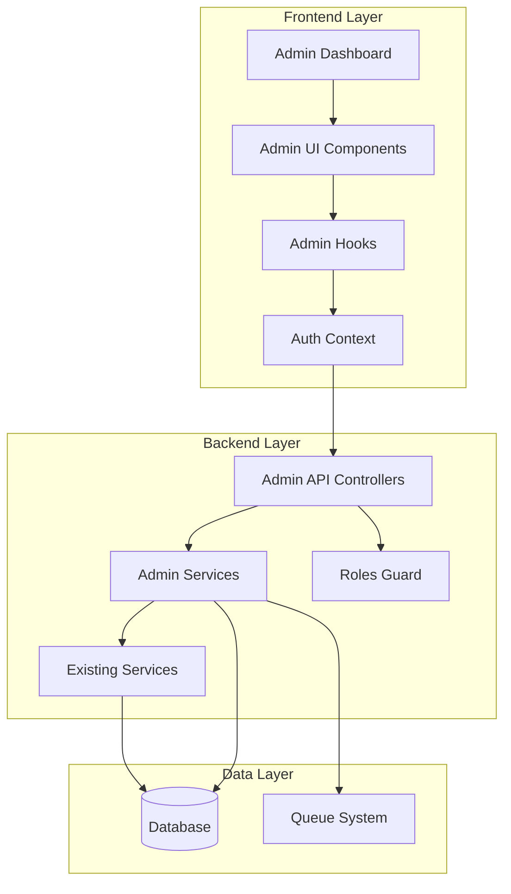
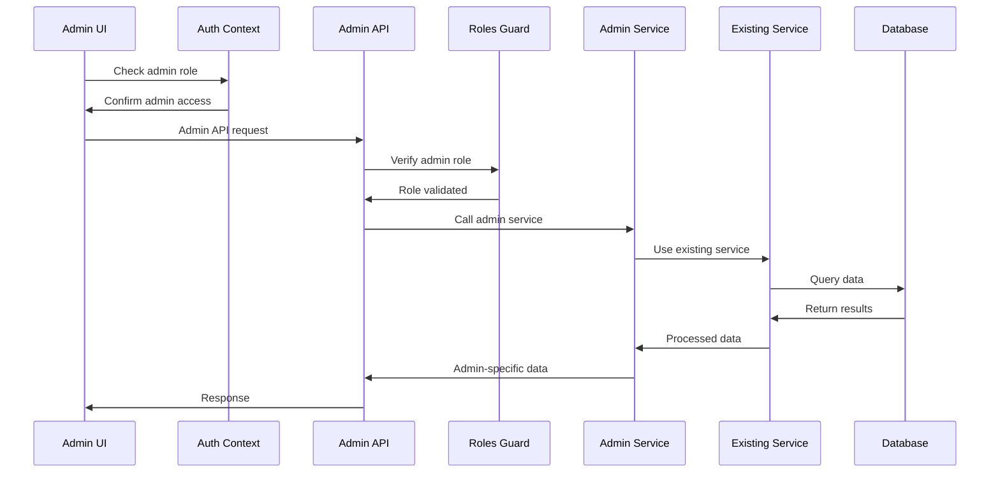

# Design Document

## Overview

This design document outlines the MVP implementation for admin role functionality in the zeroX art marketplace. The design builds upon the existing RBAC system, leveraging current authentication, user management, and data access patterns while adding essential administrative capabilities. The MVP focuses on core admin needs: dashboard overview, user management, artwork oversight, order monitoring, and system health checks.

The design prioritizes rapid implementation using existing infrastructure while establishing a scalable foundation for future administrative features.

## Architecture

### High-Level Architecture



### Admin Permission Flow



## Components and Interfaces

### Backend Components

#### 1. Admin Service Layer

```typescript
@Injectable()
export class AdminService {
  constructor(
    private readonly prisma: PrismaService,
    private readonly usersService: UsersService,
    private readonly artworksService: ArtworksService,
    private readonly ordersService: OrdersService,
    @InjectQueue(MintQueueName) private mintQueue: Queue,
  ) {}

  // Dashboard metrics
  async getDashboardStats(): Promise<AdminDashboardStats> {
    const [userCount, artworkCount, orderCount, failedMintCount] = await Promise.all([
      this.prisma.user.count(),
      this.prisma.artwork.count(),
      this.prisma.order.count({ where: { createdAt: { gte: new Date(Date.now() - 24 * 60 * 60 * 1000) } } }),
      this.prisma.order.count({ where: { orderStatus: { in: ['mint_failed', 'ownership_mint_failed'] } } })
    ]);

    return {
      totalUsers: userCount,
      totalArtworks: artworkCount,
      recentOrders: orderCount,
      failedMints: failedMintCount,
      queueStatus: await this.getQueueStatus()
    };
  }

  // User management
  async getAllUsers(page: number = 1, limit: number = 50): Promise<AdminUserList> {
    const skip = (page - 1) * limit;
    const [users, total] = await Promise.all([
      this.prisma.user.findMany({
        skip,
        take: limit,
        select: {
          id: true,
          email: true,
          name: true,
          role: true,
          kycStatus: true,
          createdAt: true,
          _count: {
            select: {
              artworks: true,
              orders: true
            }
          }
        },
        orderBy: { createdAt: 'desc' }
      }),
      this.prisma.user.count()
    ]);

    return { users, total, page, limit };
  }

  async updateUserRole(userId: string, newRole: UserRole): Promise<void> {
    await this.usersService.update(userId, { role: newRole });
    // Log admin action
    await this.logAdminAction('user_role_change', userId, { newRole });
  }

  // Artwork oversight
  async getAllArtworks(page: number = 1, limit: number = 50): Promise<AdminArtworkList> {
    const skip = (page - 1) * limit;
    const [artworks, total] = await Promise.all([
      this.prisma.artwork.findMany({
        skip,
        take: limit,
        include: {
          artist: {
            select: { id: true, name: true, email: true }
          },
          _count: {
            select: { orders: true }
          }
        },
        orderBy: { createdAt: 'desc' }
      }),
      this.prisma.artwork.count()
    ]);

    return { artworks, total, page, limit };
  }

  // Order monitoring
  async getFailedMints(): Promise<FailedMintOperation[]> {
    return this.prisma.order.findMany({
      where: {
        orderStatus: { in: ['mint_failed', 'ownership_mint_failed'] }
      },
      include: {
        artwork: { select: { title: true, artistId: true } },
        buyer: { select: { name: true, email: true } }
      },
      orderBy: { updatedAt: 'desc' }
    });
  }

  async retryMinting(orderId: string): Promise<void> {
    const order = await this.prisma.order.findUnique({
      where: { id: orderId },
      include: { artwork: true, buyer: true }
    });

    if (!order) {
      throw new NotFoundException('Order not found');
    }

    // Reset order status and re-queue
    await this.prisma.order.update({
      where: { id: orderId },
      data: { orderStatus: OrderStatus.processing }
    });

    // Re-add to mint queue
    await this.mintQueue.add('mint', {
      orderId: order.id,
      artworkId: order.artwork.id,
      metadata: this.buildMintMetadata(order)
    });

    await this.logAdminAction('mint_retry', orderId, { reason: 'admin_retry' });
  }

  // System monitoring
  async getSystemHealth(): Promise<SystemHealthStatus> {
    const queueStatus = await this.getQueueStatus();
    const recentErrors = await this.getRecentErrors();
    
    return {
      database: 'healthy', // Could add actual DB health check
      queue: queueStatus.failed > 10 ? 'warning' : 'healthy',
      externalServices: 'healthy', // Could add Hedera/Paystack health checks
      recentErrors: recentErrors.length,
      lastChecked: new Date()
    };
  }

  private async getQueueStatus() {
    const [waiting, active, completed, failed] = await Promise.all([
      this.mintQueue.getWaiting(),
      this.mintQueue.getActive(),
      this.mintQueue.getCompleted(),
      this.mintQueue.getFailed()
    ]);

    return {
      waiting: waiting.length,
      active: active.length,
      completed: completed.length,
      failed: failed.length
    };
  }

  private async logAdminAction(action: string, entityId: string, metadata: any): Promise<void> {
    await this.prisma.auditLog.create({
      data: {
        entityType: 'admin_action',
        entityId,
        action,
        metaJson: metadata
      }
    });
  }
}
```

#### 2. Admin Controller

```typescript
@Controller('admin')
@UseGuards(JwtAuthGuard, RolesGuard)
@Roles('admin')
export class AdminController {
  constructor(private readonly adminService: AdminService) {}

  @Get('dashboard')
  getDashboardStats() {
    return this.adminService.getDashboardStats();
  }

  @Get('users')
  getAllUsers(
    @Query('page') page: string = '1',
    @Query('limit') limit: string = '50'
  ) {
    return this.adminService.getAllUsers(parseInt(page), parseInt(limit));
  }

  @Put('users/:id/role')
  updateUserRole(
    @Param('id') userId: string,
    @Body() dto: UpdateUserRoleDto
  ) {
    return this.adminService.updateUserRole(userId, dto.role);
  }

  @Get('artworks')
  getAllArtworks(
    @Query('page') page: string = '1',
    @Query('limit') limit: string = '50'
  ) {
    return this.adminService.getAllArtworks(parseInt(page), parseInt(limit));
  }

  @Get('orders/failed-mints')
  getFailedMints() {
    return this.adminService.getFailedMints();
  }

  @Post('orders/:id/retry-mint')
  retryMinting(@Param('id') orderId: string) {
    return this.adminService.retryMinting(orderId);
  }

  @Get('system/health')
  getSystemHealth() {
    return this.adminService.getSystemHealth();
  }
}
```

#### 3. Admin DTOs and Types

```typescript
export interface AdminDashboardStats {
  totalUsers: number;
  totalArtworks: number;
  recentOrders: number;
  failedMints: number;
  queueStatus: QueueStatus;
}

export interface AdminUserList {
  users: AdminUserSummary[];
  total: number;
  page: number;
  limit: number;
}

export interface AdminUserSummary {
  id: string;
  email: string;
  name: string;
  role: UserRole;
  kycStatus: KycStatus;
  createdAt: Date;
  _count: {
    artworks: number;
    orders: number;
  };
}

export interface SystemHealthStatus {
  database: 'healthy' | 'warning' | 'error';
  queue: 'healthy' | 'warning' | 'error';
  externalServices: 'healthy' | 'warning' | 'error';
  recentErrors: number;
  lastChecked: Date;
}

export class UpdateUserRoleDto {
  @IsEnum(UserRole)
  role: UserRole;
}
```

### Frontend Components

#### 1. Admin Dashboard Page

```typescript
export function AdminPage() {
  const { data: dashboardStats, isLoading } = useAdminDashboard();
  const { data: systemHealth } = useSystemHealth();

  if (isLoading) {
    return <div>Loading admin dashboard...</div>;
  }

  return (
    <div className="space-y-6">
      <header>
        <h1 className="font-brand text-4xl uppercase tracking-[0.15em]">
          Admin Dashboard
        </h1>
        <p className="text-ink-muted">Platform oversight and management</p>
      </header>

      <AdminStatsGrid stats={dashboardStats} />
      
      <div className="grid grid-cols-1 lg:grid-cols-2 gap-6">
        <AdminSystemHealth health={systemHealth} />
        <AdminQuickActions />
      </div>

      <AdminRecentActivity />
    </div>
  );
}
```

#### 2. Admin Stats Grid Component

```typescript
interface AdminStatsGridProps {
  stats: AdminDashboardStats;
}

export function AdminStatsGrid({ stats }: AdminStatsGridProps) {
  const statItems = [
    { label: 'Total Users', value: stats.totalUsers, icon: '👥' },
    { label: 'Total Artworks', value: stats.totalArtworks, icon: '🎨' },
    { label: 'Recent Orders (24h)', value: stats.recentOrders, icon: '📦' },
    { 
      label: 'Failed Mints', 
      value: stats.failedMints, 
      icon: '⚠️',
      variant: stats.failedMints > 0 ? 'warning' : 'default'
    }
  ];

  return (
    <div className="grid grid-cols-1 md:grid-cols-2 lg:grid-cols-4 gap-4">
      {statItems.map((item) => (
        <div 
          key={item.label}
          className={`p-4 rounded-lg border ${
            item.variant === 'warning' 
              ? 'border-yellow-200 bg-yellow-50' 
              : 'border-gray-200 bg-white'
          }`}
        >
          <div className="flex items-center justify-between">
            <div>
              <p className="text-sm text-ink-muted">{item.label}</p>
              <p className="text-2xl font-semibold">{item.value}</p>
            </div>
            <span className="text-2xl">{item.icon}</span>
          </div>
        </div>
      ))}
    </div>
  );
}
```

#### 3. Admin User Management

```typescript
export function AdminUserManagement() {
  const [page, setPage] = useState(1);
  const { data: userList, isLoading } = useAdminUsers(page);
  const updateRoleMutation = useUpdateUserRole();

  const handleRoleChange = async (userId: string, newRole: UserRole) => {
    try {
      await updateRoleMutation.mutateAsync({ userId, role: newRole });
      // Show success toast
    } catch (error) {
      // Show error toast
    }
  };

  if (isLoading) {
    return <div>Loading users...</div>;
  }

  return (
    <div className="space-y-4">
      <h2 className="text-2xl font-semibold">User Management</h2>
      
      <div className="overflow-x-auto">
        <table className="w-full border-collapse border border-gray-200">
          <thead>
            <tr className="bg-gray-50">
              <th className="border border-gray-200 p-3 text-left">Email</th>
              <th className="border border-gray-200 p-3 text-left">Name</th>
              <th className="border border-gray-200 p-3 text-left">Role</th>
              <th className="border border-gray-200 p-3 text-left">KYC Status</th>
              <th className="border border-gray-200 p-3 text-left">Artworks</th>
              <th className="border border-gray-200 p-3 text-left">Orders</th>
              <th className="border border-gray-200 p-3 text-left">Actions</th>
            </tr>
          </thead>
          <tbody>
            {userList?.users.map((user) => (
              <tr key={user.id}>
                <td className="border border-gray-200 p-3">{user.email}</td>
                <td className="border border-gray-200 p-3">{user.name}</td>
                <td className="border border-gray-200 p-3">
                  <RoleSelect
                    value={user.role}
                    onChange={(role) => handleRoleChange(user.id, role)}
                  />
                </td>
                <td className="border border-gray-200 p-3">
                  <Badge variant={getKycStatusVariant(user.kycStatus)}>
                    {user.kycStatus}
                  </Badge>
                </td>
                <td className="border border-gray-200 p-3">{user._count.artworks}</td>
                <td className="border border-gray-200 p-3">{user._count.orders}</td>
                <td className="border border-gray-200 p-3">
                  <Button size="sm" variant="secondary">
                    View Details
                  </Button>
                </td>
              </tr>
            ))}
          </tbody>
        </table>
      </div>

      <AdminPagination
        currentPage={page}
        totalPages={Math.ceil((userList?.total || 0) / (userList?.limit || 50))}
        onPageChange={setPage}
      />
    </div>
  );
}
```

#### 4. Admin Hooks

```typescript
export function useAdminDashboard() {
  return useQuery({
    queryKey: ['admin', 'dashboard'],
    queryFn: () => adminApi.getDashboardStats(),
    refetchInterval: 30000, // Refresh every 30 seconds
  });
}

export function useAdminUsers(page: number = 1, limit: number = 50) {
  return useQuery({
    queryKey: ['admin', 'users', page, limit],
    queryFn: () => adminApi.getAllUsers(page, limit),
  });
}

export function useUpdateUserRole() {
  const queryClient = useQueryClient();
  
  return useMutation({
    mutationFn: ({ userId, role }: { userId: string; role: UserRole }) =>
      adminApi.updateUserRole(userId, role),
    onSuccess: () => {
      queryClient.invalidateQueries({ queryKey: ['admin', 'users'] });
    },
  });
}

export function useFailedMints() {
  return useQuery({
    queryKey: ['admin', 'failed-mints'],
    queryFn: () => adminApi.getFailedMints(),
    refetchInterval: 60000, // Refresh every minute
  });
}

export function useRetryMinting() {
  const queryClient = useQueryClient();
  
  return useMutation({
    mutationFn: (orderId: string) => adminApi.retryMinting(orderId),
    onSuccess: () => {
      queryClient.invalidateQueries({ queryKey: ['admin', 'failed-mints'] });
      queryClient.invalidateQueries({ queryKey: ['admin', 'dashboard'] });
    },
  });
}
```

#### 5. Admin API Client

```typescript
class AdminApiClient {
  private baseUrl = '/api/admin';

  async getDashboardStats(): Promise<AdminDashboardStats> {
    const response = await fetch(`${this.baseUrl}/dashboard`);
    if (!response.ok) throw new Error('Failed to fetch dashboard stats');
    return response.json();
  }

  async getAllUsers(page: number = 1, limit: number = 50): Promise<AdminUserList> {
    const response = await fetch(`${this.baseUrl}/users?page=${page}&limit=${limit}`);
    if (!response.ok) throw new Error('Failed to fetch users');
    return response.json();
  }

  async updateUserRole(userId: string, role: UserRole): Promise<void> {
    const response = await fetch(`${this.baseUrl}/users/${userId}/role`, {
      method: 'PUT',
      headers: { 'Content-Type': 'application/json' },
      body: JSON.stringify({ role }),
    });
    if (!response.ok) throw new Error('Failed to update user role');
  }

  async getAllArtworks(page: number = 1, limit: number = 50): Promise<AdminArtworkList> {
    const response = await fetch(`${this.baseUrl}/artworks?page=${page}&limit=${limit}`);
    if (!response.ok) throw new Error('Failed to fetch artworks');
    return response.json();
  }

  async getFailedMints(): Promise<FailedMintOperation[]> {
    const response = await fetch(`${this.baseUrl}/orders/failed-mints`);
    if (!response.ok) throw new Error('Failed to fetch failed mints');
    return response.json();
  }

  async retryMinting(orderId: string): Promise<void> {
    const response = await fetch(`${this.baseUrl}/orders/${orderId}/retry-mint`, {
      method: 'POST',
    });
    if (!response.ok) throw new Error('Failed to retry minting');
  }

  async getSystemHealth(): Promise<SystemHealthStatus> {
    const response = await fetch(`${this.baseUrl}/system/health`);
    if (!response.ok) throw new Error('Failed to fetch system health');
    return response.json();
  }
}

export const adminApi = new AdminApiClient();
```

## Data Models

### Leveraging Existing Schema

The MVP leverages the existing database schema without requiring new tables:

- **Users**: Use existing `User` model with `role` field for admin identification
- **Artworks**: Use existing `Artwork` model for content oversight
- **Orders**: Use existing `Order` model for transaction monitoring
- **AuditLog**: Use existing `AuditLog` model for admin action tracking

### New Admin-Specific Types

```typescript
// Admin dashboard aggregations
interface AdminDashboardStats {
  totalUsers: number;
  totalArtworks: number;
  recentOrders: number;
  failedMints: number;
  queueStatus: QueueStatus;
}

// System health monitoring
interface SystemHealthStatus {
  database: HealthStatus;
  queue: HealthStatus;
  externalServices: HealthStatus;
  recentErrors: number;
  lastChecked: Date;
}

type HealthStatus = 'healthy' | 'warning' | 'error';

// Failed mint operations
interface FailedMintOperation {
  id: string;
  orderId: string;
  artworkTitle: string;
  buyerEmail: string;
  failureReason: string;
  lastAttempt: Date;
  retryCount: number;
}
```

## Error Handling

### Admin-Specific Error Types

```typescript
export class AdminPermissionError extends Error {
  constructor(action: string) {
    super(`Admin permission required for action: ${action}`);
    this.name = 'AdminPermissionError';
  }
}

export class AdminOperationError extends Error {
  constructor(operation: string, reason: string) {
    super(`Admin operation failed: ${operation} - ${reason}`);
    this.name = 'AdminOperationError';
  }
}
```

### Frontend Error Boundaries

```typescript
export function AdminErrorBoundary({ children }: { children: React.ReactNode }) {
  return (
    <ErrorBoundary
      fallback={({ error, resetError }) => (
        <div className="p-6 text-center">
          <h2 className="text-xl font-semibold text-red-600 mb-2">
            Admin Panel Error
          </h2>
          <p className="text-gray-600 mb-4">
            {error instanceof AdminPermissionError 
              ? 'You do not have permission to perform this action.'
              : 'An error occurred in the admin panel. Please try again.'}
          </p>
          <Button onClick={resetError}>Try Again</Button>
        </div>
      )}
    >
      {children}
    </ErrorBoundary>
  );
}
```

## Testing Strategy

### Backend Testing

1. **Unit Tests**
   - Admin service methods
   - Permission validation
   - Data aggregation logic

2. **Integration Tests**
   - Admin API endpoints
   - Role-based access control
   - Database queries and updates

3. **E2E Tests**
   - Complete admin workflows
   - Permission boundary testing

### Frontend Testing

1. **Component Tests**
   - Admin dashboard rendering
   - User management interactions
   - Error state handling

2. **Hook Tests**
   - Admin API integration
   - Data fetching and caching
   - Mutation handling

3. **Integration Tests**
   - Full admin user journeys
   - Permission-based UI rendering

## Performance Considerations

### Backend Optimization

1. **Database Queries**
   - Efficient aggregation queries for dashboard stats
   - Proper indexing for admin queries
   - Pagination for large datasets

2. **Caching Strategy**
   - Cache dashboard statistics (5-minute TTL)
   - Cache user lists (2-minute TTL)
   - Real-time updates for critical metrics

### Frontend Optimization

1. **Data Fetching**
   - React Query for caching and background updates
   - Optimistic updates for user role changes
   - Polling for real-time dashboard updates

2. **Component Performance**
   - Virtualized tables for large user/artwork lists
   - Memoized components for expensive renders
   - Lazy loading for admin sections

## Security Considerations

### Access Control

1. **Role Verification**
   - Server-side admin role validation on every request
   - JWT token validation with role claims
   - Session timeout enforcement

2. **Audit Logging**
   - Log all admin actions with timestamps
   - Track sensitive operations (role changes, minting retries)
   - Maintain audit trail for compliance

### Data Protection

1. **Sensitive Data Handling**
   - Exclude password hashes from admin user views
   - Limit exposure of personal information
   - Secure handling of payment data

2. **API Security**
   - Rate limiting on admin endpoints
   - Input validation and sanitization
   - CORS configuration for admin routes

This design provides a comprehensive, scalable admin role system that leverages existing infrastructure while adding essential administrative capabilities for the zeroX marketplace platform.