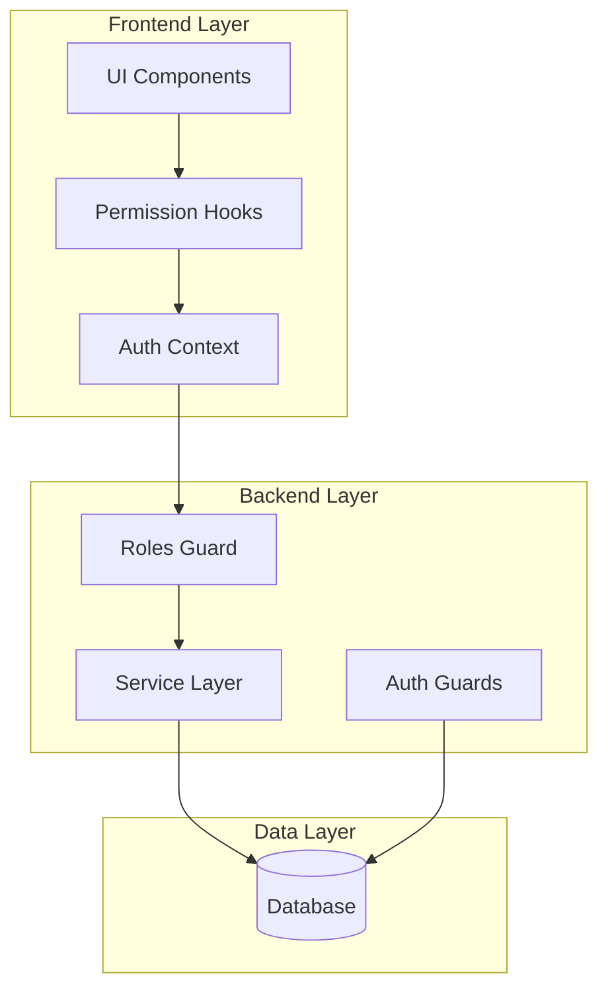
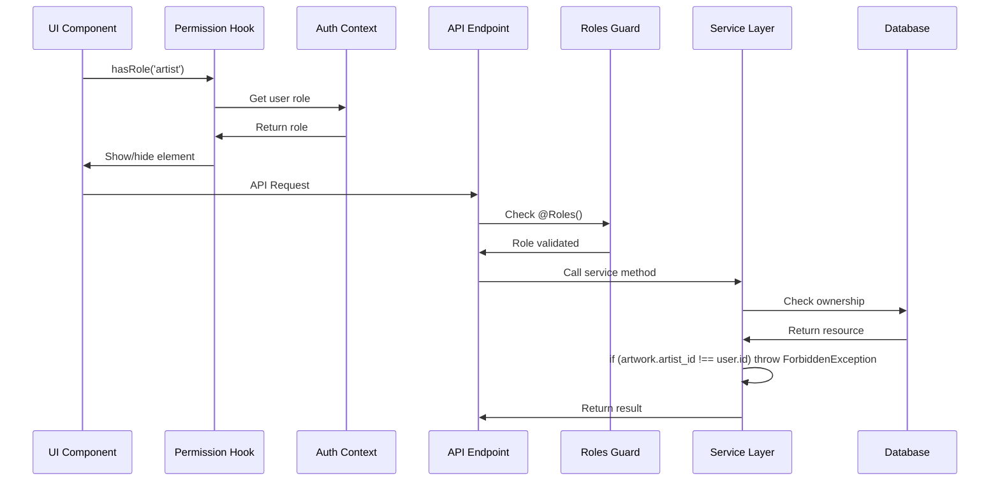

# Design Document

## Overview

This design document outlines the MVP Role-Based Access Control (RBAC) system for the zeroX art marketplace, focusing on buyer and artist roles with a simplified approach. The system uses basic role-based guards with @Roles() decorator and resource ownership checks in the service layer, providing essential access control without complex permission tables.

The design prioritizes quick implementation and maintainability, deferring fine-grained permission delegation until post-MVP when more sophisticated access control is needed.

## Architecture

### High-Level Architecture



### MVP Permission Flow



## Components and Interfaces

### Backend Components

#### 1. Simple Roles Guard

```typescript
@Injectable()
export class RolesGuard implements CanActivate {
  constructor(private reflector: Reflector) {}

  canActivate(context: ExecutionContext): boolean {
    const requiredRoles = this.reflector.getAllAndOverride<UserRole[]>('roles', [
      context.getHandler(),
      context.getClass(),
    ]);

    if (!requiredRoles) {
      return true;
    }

    const { user } = context.switchToHttp().getRequest();
    return requiredRoles.includes(user.role);
  }
}

// Roles decorator
export const Roles = (...roles: UserRole[]) => SetMetadata('roles', roles);
```

#### 2. Service Layer Ownership Checks

```typescript
// Example in ArtworkService
@Injectable()
export class ArtworkService {
  constructor(private prisma: PrismaService) {}

  async updateArtwork(id: string, userId: string, updateData: UpdateArtworkDto) {
    const artwork = await this.prisma.artwork.findUnique({ where: { id } });
    
    if (!artwork) {
      throw new NotFoundException('Artwork not found');
    }
    
    // Simple ownership check
    if (artwork.artist_id !== userId) {
      throw new ForbiddenException('You can only edit your own artworks');
    }
    
    return this.prisma.artwork.update({
      where: { id },
      data: updateData,
    });
  }

  async deleteArtwork(id: string, userId: string) {
    const artwork = await this.prisma.artwork.findUnique({ where: { id } });
    
    if (!artwork) {
      throw new NotFoundException('Artwork not found');
    }
    
    if (artwork.artist_id !== userId) {
      throw new ForbiddenException('You can only delete your own artworks');
    }
    
    return this.prisma.artwork.delete({ where: { id } });
  }
}
```

#### 3. Controller Implementation

```typescript
@Controller('artworks')
@UseGuards(JwtAuthGuard, RolesGuard)
export class ArtworkController {
  constructor(private artworkService: ArtworkService) {}

  @Post()
  @Roles('artist')
  createArtwork(@Body() createDto: CreateArtworkDto, @Request() req) {
    return this.artworkService.createArtwork(createDto, req.user.id);
  }

  @Put(':id')
  @Roles('artist')
  updateArtwork(
    @Param('id') id: string,
    @Body() updateDto: UpdateArtworkDto,
    @Request() req
  ) {
    // Ownership check happens in service layer
    return this.artworkService.updateArtwork(id, req.user.id, updateDto);
  }

  @Delete(':id')
  @Roles('artist')
  deleteArtwork(@Param('id') id: string, @Request() req) {
    return this.artworkService.deleteArtwork(id, req.user.id);
  }

  @Get()
  @Roles('buyer', 'artist')
  getArtworks(@Request() req) {
    return this.artworkService.getArtworks(req.user);
  }
}

### Frontend Components

#### 1. Basic Permission Hooks

```typescript
interface UsePermissionsReturn {
  hasRole: (roles: UserRole[]) => boolean;
  isOwner: (resourceOwnerId: string) => boolean;
  user: User | null;
}

export function usePermissions(): UsePermissionsReturn {
  const { user } = useAuth();

  const hasRole = useCallback((roles: UserRole[]) => {
    return user ? roles.includes(user.role) : false;
  }, [user]);

  const isOwner = useCallback((resourceOwnerId: string) => {
    return user ? user.id === resourceOwnerId : false;
  }, [user]);

  return { hasRole, isOwner, user };
}
```

#### 2. Simple Role-Based Components

```typescript
// Basic role wrapper
interface RoleWrapperProps {
  roles: UserRole[];
  fallback?: React.ReactNode;
  children: React.ReactNode;
}

export function RoleWrapper({ roles, fallback = null, children }: RoleWrapperProps) {
  const { hasRole } = usePermissions();
  
  return hasRole(roles) ? <>{children}</> : <>{fallback}</>;
}

// Ownership wrapper
interface OwnershipWrapperProps {
  ownerId: string;
  fallback?: React.ReactNode;
  children: React.ReactNode;
}

export function OwnershipWrapper({ ownerId, fallback = null, children }: OwnershipWrapperProps) {
  const { isOwner } = usePermissions();
  
  return isOwner(ownerId) ? <>{children}</> : <>{fallback}</>;
}

// Usage examples
<RoleWrapper roles={['artist']}>
  <Button>Create Artwork</Button>
</RoleWrapper>

<OwnershipWrapper ownerId={artwork.artist_id}>
  <EditButton />
</OwnershipWrapper>
```

#### 3. Role-Specific Navigation

```typescript
interface NavigationItem {
  path: string;
  label: string;
  roles: UserRole[];
}

const navigationItems: NavigationItem[] = [
  { path: '/gallery', label: 'Gallery', roles: ['buyer', 'artist'] },
  { path: '/create', label: 'Create Artwork', roles: ['artist'] },
  { path: '/portfolio', label: 'My Portfolio', roles: ['artist'] },
  { path: '/collection', label: 'My Collection', roles: ['buyer'] },
  { path: '/profile', label: 'Profile', roles: ['buyer', 'artist'] },
];

export function Navigation() {
  const { hasRole } = usePermissions();
  
  const visibleItems = navigationItems.filter(item => hasRole(item.roles));

  return (
    <nav>
      {visibleItems.map(item => (
        <NavLink key={item.path} to={item.path}>
          {item.label}
        </NavLink>
      ))}
    </nav>
  );
}
```

#### 4. Conditional UI Elements

```typescript
// In artwork detail component
export function ArtworkDetail({ artwork }: { artwork: Artwork }) {
  const { hasRole, isOwner } = usePermissions();

  return (
    <div>
      <h1>{artwork.title}</h1>
      <p>{artwork.description}</p>
      
      {/* Show purchase button only to buyers who don't own the artwork */}
      {hasRole(['buyer']) && !isOwner(artwork.artist_id) && (
        <Button onClick={() => purchaseArtwork(artwork.id)}>
          Purchase for ${artwork.price}
        </Button>
      )}
      
      {/* Show edit/delete buttons only to the artist who owns it */}
      {hasRole(['artist']) && isOwner(artwork.artist_id) && (
        <div>
          <Button onClick={() => editArtwork(artwork.id)}>Edit</Button>
          <Button onClick={() => deleteArtwork(artwork.id)}>Delete</Button>
        </div>
      )}
    </div>
  );
}
```

## Data Models

### Existing Models (No Changes Required)

The MVP approach leverages existing database schema without additional permission tables:

```typescript
// Existing User model (no changes needed)
interface User {
  id: string;
  email: string;
  role: UserRole; // 'buyer' | 'artist' | 'admin'
  // ... other existing fields
}

// Existing Artwork model (already has ownership)
interface Artwork {
  id: string;
  title: string;
  artist_id: string; // Foreign key to User
  // ... other existing fields
}

// Existing Order model (already has ownership)
interface Order {
  id: string;
  buyer_id: string; // Foreign key to User
  artwork_id: string; // Foreign key to Artwork
  // ... other existing fields
}
```

### Design Rationale

The MVP approach intentionally avoids complex permission tables by:
- Using the existing `role` field on the User model for role-based checks
- Leveraging existing foreign key relationships (artist_id, buyer_id) for ownership checks
- Deferring fine-grained permission tables until post-MVP requirements emerge

## Error Handling

### Permission Errors

```typescript
export class InsufficientPermissionError extends Error {
  constructor(
    public readonly requiredPermission: string,
    public readonly userRole: string,
    public readonly resource?: string
  ) {
    super(`Insufficient permission: ${requiredPermission}`);
    this.name = 'InsufficientPermissionError';
  }
}

export class ResourceNotFoundError extends Error {
  constructor(public readonly resourceType: string, public readonly resourceId: string) {
    super(`Resource not found: ${resourceType}:${resourceId}`);
    this.name = 'ResourceNotFoundError';
  }
}
```

### Frontend Error Boundaries

```typescript
export function PermissionErrorBoundary({ children }: { children: React.ReactNode }) {
  return (
    <ErrorBoundary
      fallback={({ error }) => {
        if (error instanceof InsufficientPermissionError) {
          return <div>You don't have permission to access this feature.</div>;
        }
        return <div>Something went wrong.</div>;
      }}
    >
      {children}
    </ErrorBoundary>
  );
}
```

## Testing Strategy

### Backend Testing

1. **Unit Tests**
   - Permission service logic
   - Guard implementations
   - Role-based access control

2. **Integration Tests**
   - API endpoints with role restrictions
   - Resource ownership validation
   - Permission caching behavior

3. **E2E Tests**
   - Complete user workflows by role
   - Permission boundary testing

### Frontend Testing

1. **Component Tests**
   - Permission wrapper rendering
   - Role-based navigation
   - Conditional UI elements

2. **Hook Tests**
   - Permission checking logic
   - Auth context integration
   - Cache invalidation

3. **Integration Tests**
   - Full user journey testing
   - Role switching scenarios
   - Permission state management

### Test Data Setup

```typescript
// Test user factory
export const createTestUser = (role: UserRole, permissions: string[] = []) => ({
  id: uuid(),
  email: `test-${role}@example.com`,
  role,
  permissions,
  // ... other fields
});

// Permission test scenarios
export const permissionScenarios = {
  artist: {
    allowed: ['artwork:create', 'artwork:edit:own', 'profile:edit'],
    denied: ['artwork:edit:others', 'user:manage', 'admin:access']
  },
  buyer: {
    allowed: ['artwork:purchase', 'profile:edit', 'collection:view'],
    denied: ['artwork:create', 'artwork:edit', 'artist:dashboard']
  }
};
```

## Performance Considerations

### Caching Strategy

1. **Redis Caching**
   - User permissions cached for 15 minutes
   - Resource permissions cached for 5 minutes
   - Cache invalidation on role/permission changes

2. **Frontend Caching**
   - Permission results cached in React Query
   - Automatic cache invalidation on auth state changes

### Database Optimization

1. **Indexes**
   - Composite indexes on (user_id, resource_type, resource_id)
   - Role-based permission lookups
   - Audit log queries

2. **Query Optimization**
   - Bulk permission checks for UI rendering
   - Efficient resource ownership queries
   - Minimal database round trips

### Bundle Size Optimization

1. **Code Splitting**
   - Role-specific components loaded on demand
   - Permission utilities tree-shaken
   - Lazy loading for admin features

This design provides a comprehensive, scalable RBAC system that prioritizes user experience through permission-aware UI components while maintaining strong security boundaries at the API level.