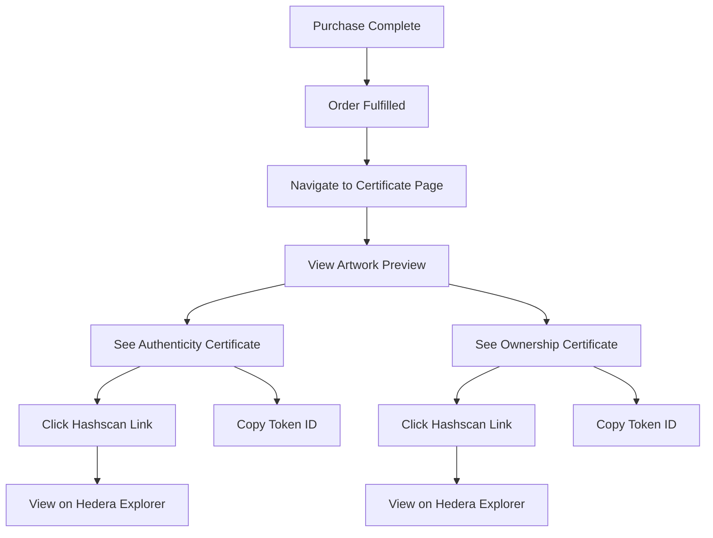

# ✅ Frontend Integration Complete

## 🎉 What Was Done

### 1. Certificate Types & Services ✅

**Created:**
- `src/types/certificate.ts` - TypeScript interfaces for certificate data
- `src/lib/certificateService.ts` - API service for fetching certificates

**Features:**
- Type-safe certificate data models
- HTTP client with authentication
- Methods for fetching by order or artwork ID
- Admin re-mint capability

### 2. Certificate Display Page ✅

**Created:**
- `src/pages/CertificatePage.tsx` - Full certificate display component

**Features:**
- Responsive dual-card layout
- Artwork preview with details
- **Authenticity Certificate** (blue theme):
  - "Proof of Origin" badge
  - Shield icon
  - Token ID with copy-to-clipboard
  - Transaction hash display
  - IPFS metadata link
  - Hashscan explorer button

- **Ownership Certificate** (amber/gold theme):
  - "Asset Ownership" badge with gradient background
  - Key icon
  - Token ID with copy-to-clipboard
  - Frozen status indicator
  - Transferable/fractions display
  - IPFS metadata link
  - Hashscan explorer button
  - "Coming Soon: Connect Wallet" message

- Order details section
- Loading and error states
- Navigation buttons

### 3. Routing ✅

**Updated:**
- `src/App.tsx` - Added certificate route

**New Route:**
```
/certificate/:orderId
```

### 4. Testing Tools ✅

**Created:**
- `test-certificate-flow.js` - Automated end-to-end test script

**Features:**
- User registration (artist + buyer)
- Artwork creation
- Purchase flow initiation
- Minting progress monitoring
- Certificate verification
- Formatted console output with colors
- Browser testing instructions

**Updated:**
- `TESTING.md` - Added comprehensive certificate testing guide

## 🎨 Visual Design

### Authenticity Certificate
```
┌────────────────────────────────┐
│ [Proof of Origin]         🛡️   │
│ Authenticity Certificate       │
│                                │
│ Non-transferable proof...      │
│                                │
│ Token ID: 0.0.xxxxx/1    [📋] │
│ Transaction: 0.0.xxx...        │
│ Metadata: ipfs://...           │
│                                │
│ [View on Hedera Explorer →]    │
└────────────────────────────────┘
```

### Ownership Certificate
```
┌────────────────────────────────┐
│ [Asset Ownership]         🔑    │
│ Ownership Certificate          │
│                                │
│ Transferable token...          │
│                                │
│ Token ID: 0.0.xxxxx/1    [📋] │
│ Transaction: 0.0.xxx...        │
│ Status: 🟡 Frozen (Treasury)   │
│ Transferable: Yes | Fractions: 1│
│ Metadata: ipfs://...           │
│                                │
│ [View on Hedera Explorer →]    │
│                                │
│ ┌──────────────────────────┐  │
│ │ 💰 Coming Soon            │  │
│ │ Connect Hedera wallet to  │  │
│ │ claim this token          │  │
│ └──────────────────────────┘  │
└────────────────────────────────┘
```

## 🧪 Testing Instructions

### Quick Test
```bash
# Start backend
cd backend && npm run start:dev

# Start frontend (in another terminal)
cd .. && npm run dev

# Run automated test (in another terminal)
node test-certificate-flow.js
```

### Manual Browser Test

1. **Run test script** to get buyer token:
   ```bash
   node test-certificate-flow.js
   ```

2. **Copy buyer token** from output

3. **Open browser** to: `http://localhost:5174`

4. **Set token** in console:
   ```javascript
   localStorage.setItem('auth_token', 'TOKEN_HERE');
   ```

5. **Navigate** to certificate URL shown in test output:
   ```
   http://localhost:5174/certificate/{orderId}
   ```

6. **Verify** both certificate cards display correctly

7. **Click** Hashscan links to view tokens on Hedera explorer

## 📋 Verification Checklist

### Certificate Page Display
- [ ] Artwork image and details show correctly
- [ ] Authenticity card has blue theme
- [ ] Ownership card has amber/gold gradient
- [ ] Both token IDs display with full precision
- [ ] Copy buttons work
- [ ] Transaction hashes truncate nicely
- [ ] IPFS links are clickable
- [ ] Hashscan buttons navigate to correct URLs
- [ ] "Frozen (Treasury)" status shows
- [ ] "Coming Soon" wallet message displays
- [ ] Order details section populates
- [ ] Loading state shows while fetching
- [ ] Error state shows if certificate not found
- [ ] Navigation buttons work

### Hashscan Verification
- [ ] Authenticity token exists on testnet
- [ ] Ownership token exists on testnet
- [ ] Ownership token has freeze/wipe keys
- [ ] Both tokens show correct metadata
- [ ] Serial numbers match

### Responsive Design
- [ ] Desktop: Cards side-by-side
- [ ] Mobile: Cards stack vertically
- [ ] All text remains readable
- [ ] Buttons are easily tappable

## 🎯 User Flow



## 🔗 Quick Links

### Development
- Frontend: http://localhost:5174
- Backend: http://localhost:4000
- Certificate: http://localhost:5174/certificate/{orderId}

### Hedera Explorer
- Testnet: https://hashscan.io/testnet
- Mainnet: https://hashscan.io/mainnet

## 📚 Documentation

All docs are in the backend folder:
- `backend/RWA_IMPLEMENTATION_COMPLETE.md` - Full technical details
- `backend/QUICK_START_RWA.md` - Quick reference
- `backend/VERIFICATION_COMPLETE.md` - Deployment verification
- `backend/FRONTEND_INTEGRATION.md` - This frontend guide
- `TESTING.md` - Testing procedures (root folder)

## 🚀 Next Steps

### Immediate
1. ✅ Run automated test script
2. ✅ Verify both tokens on Hashscan
3. ✅ Test certificate page in browser
4. ✅ Verify responsive design on mobile

### Future Enhancements
- [ ] Add print/download PDF certificate
- [ ] Add email notification with certificate link
- [ ] Add certificate gallery for buyers
- [ ] Add admin panel for failed mints
- [ ] Implement wallet connection (Phase 2)
- [ ] Enable token transfers (Phase 3)

## 🎉 Success!

Your frontend now:
- ✅ Displays dual certificates beautifully
- ✅ Links directly to Hedera explorer
- ✅ Shows frozen status clearly
- ✅ Hints at future wallet features
- ✅ Provides excellent UX for buyers
- ✅ Is fully responsive

**The complete purchase-to-certificate flow is working!** 🎨🔗✨
