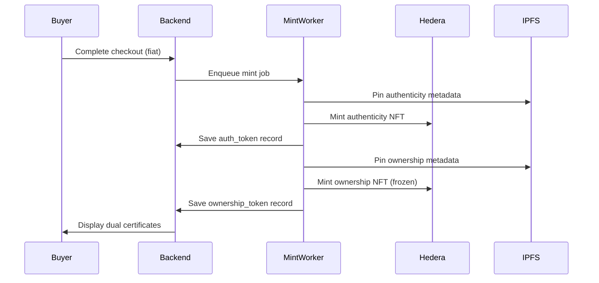

# RWA Tokenization Implementation Guide

## 🎯 Overview

Successfully implemented **dual-token architecture** for Real World Asset (RWA) tokenization on Hedera. Every artwork purchase now generates:

1. **Authenticity Token** - Non-transferable proof of origin
2. **Ownership Token** - Transferable RWA token representing legal ownership rights

## 📋 What Was Implemented

### ✅ Database Layer
- **New Table**: `ownership_tokens`
  - Links to `auth_tokens`, `orders`, `artworks`, and `users`
  - Tracks `transferable` status and `fractions` for future fractionalization
  - Stores Hedera token ID, transaction hash, and IPFS metadata

- **New Order Status**: `ownership_mint_failed`
  - Differentiates between authenticity vs ownership minting failures
  - Enables targeted admin remediation

### ✅ Hedera Token Creation
- **New Script**: `scripts/create-ownership-token.js`
  - Creates NFT collection with **freeze** and **wipe** keys
  - Tokens minted **frozen by default** (no transfers until unfrozen)
  - Symbol: `HAOC` (Hedera Art Ownership Certificates)
  - Run with: `npm run setup:ownership-token`

### ✅ Service Layer
- **New Module**: `TokenizationModule`
  - `TokenizationService` - Handles ownership token minting and metadata
  - `TokenizationController` - API endpoints for certificates and admin actions
  
- **Key Methods**:
  - `mintOwnershipToken()` - Mints frozen ownership NFT
  - `createOwnershipMetadata()` - Follows HIP-412 standard with provenance
  - `linkToAuthenticityToken()` - Creates database relationship

### ✅ Worker Enhancement
- **Updated**: `mint-authenticity.worker.ts`
  - Now performs **dual minting** in sequence:
    1. Mint authenticity certificate (non-transferable)
    2. Mint ownership certificate (frozen, transferable when ready)
    3. Link both tokens and update order to `fulfilled`
  
- **Error Handling**:
  - Partial success tracked (authenticity succeeded, ownership failed)
  - Admin can re-mint only the failed token

### ✅ API Endpoints

#### Public/Authenticated
```http
GET /ownership/artwork/:artworkId
GET /ownership/order/:orderId
```
Returns complete certificate data with both tokens and Hashscan links.

#### Admin Only
```http
POST /ownership/admin/re-mint
Body: { "orderId": "uuid" }
```
Re-mints ownership token for orders with `ownership_mint_failed` status.

### ✅ Configuration
- **New Environment Variable**: `HEDERA_OWNERSHIP_TOKEN_ID`
- Added to `configuration.ts` and `.env.example`

## 🗂️ File Changes Summary

### Created Files
```
backend/
├── scripts/
│   └── create-ownership-token.js          # Token creation script
├── src/modules/tokenization/
│   ├── tokenization.module.ts              # Module definition
│   ├── tokenization.service.ts             # Core business logic
│   ├── tokenization.controller.ts          # API endpoints
│   ├── dto/
│   │   ├── ownership-certificate.dto.ts    # Response shape
│   │   └── remint-ownership.dto.ts         # Admin request
│   └── interfaces/
│       └── ownership-metadata.interface.ts # Metadata types
└── .env.example                             # Environment template
```

### Modified Files
```
backend/
├── prisma/schema.prisma                     # Added ownership_tokens table
├── src/
│   ├── app.module.ts                        # Registered TokenizationModule
│   ├── config/configuration.ts              # Added ownership token ID
│   ├── queue/queue.module.ts                # Added TokenizationModule
│   └── workers/mint-authenticity.worker.ts  # Dual minting logic
└── package.json                             # Added setup:ownership-token script
```

## 🚀 Deployment Steps

### 1. Update Environment
```bash
# In your .env file, add:
HEDERA_OWNERSHIP_TOKEN_ID=0.0.xxxxx  # Get from step 2
```

### 2. Create Ownership Token on Hedera
```bash
cd backend
npm run setup:ownership-token
```
This will output a token ID - **add it to your .env file**.

### 3. Run Database Migrations
```bash
npm run prisma:migrate
```

### 4. Restart Application
```bash
npm run start:dev  # Development
# or
npm run start:prod  # Production
```

## 📊 Data Flow



## 🔑 Key Architectural Decisions

### 1. Two Separate Token Collections
- **Authenticity Token** (`HEDERA_NFT_TOKEN_ID`)
  - No freeze/wipe keys
  - Permanently immutable
  - Proof of origin only

- **Ownership Token** (`HEDERA_OWNERSHIP_TOKEN_ID`)
  - Has freeze + wipe keys
  - Starts frozen (no transfers)
  - Future-ready for wallet transfers

### 2. Frozen by Default
Ownership tokens are minted frozen to:
- Keep custody in treasury until buyer connects wallet
- Enable future secondary marketplace with controlled unfreezing
- Maintain compliance and control during MVP phase

### 3. Metadata Cross-Reference
Ownership token metadata includes:
```json
{
  "properties": {
    "authenticity_token": {
      "token_id": "0.0.123456",
      "serial": "1",
      "ipfs": "ipfs://..."
    },
    "provenance": [
      { "event": "created", "owner": "Artist" },
      { "event": "purchased", "owner": "Buyer" }
    ]
  }
}
```

## 🧪 Testing

### Test Dual Minting
1. Create an artwork as an artist
2. Purchase it as a buyer
3. Check order status: should be `fulfilled`
4. Query both endpoints:
```bash
GET /ownership/order/{orderId}
GET /ownership/artwork/{artworkId}
```

### Test Admin Re-mint
1. Simulate failure: delete ownership_token record, set order to `ownership_mint_failed`
2. Call admin endpoint:
```bash
POST /ownership/admin/re-mint
{ "orderId": "..." }
```

## 📈 Cost Analysis

**Per Sale:**
- Authenticity NFT mint: ~$0.001 USD
- Ownership NFT mint: ~$0.001 USD
- **Total**: ~$0.002 USD per artwork sale

## 🔮 Future Enhancements

### Phase 2: Wallet Integration
1. Add "Connect Hedera Wallet" button for buyers
2. Implement token association flow
3. Transfer ownership token from treasury to buyer's wallet
4. Unfreeze token for secondary market

### Phase 3: Fractionalization
The `fractions` field is already in place:
```typescript
// Current: whole ownership
fractions: 1

// Future: fractional ownership
fractions: 100  // 1% shares
```

### Phase 4: Secondary Marketplace
- Build auction/listing system
- Implement freeze/unfreeze logic for bidders
- Track provenance on-chain
- Enforce optional royalties

## 🔒 Security Notes

### Key Management
- **Operator Key**: Used for transaction signing
- **Treasury Key**: Used for minting (supply key)
- **Freeze Key**: Controls transfer permissions
- **Wipe Key**: Emergency clawback capability

**⚠️ All keys must be stored securely** (AWS Secrets Manager, HashiCorp Vault, etc.)

### Access Control
- Ownership endpoints require JWT authentication
- Admin re-mint endpoint requires `admin` role
- RolesGuard enforces RBAC

## 📝 API Examples

### Get Ownership Certificate
```http
GET /ownership/order/550e8400-e29b-41d4-a716-446655440000
Authorization: Bearer <jwt_token>

Response:
{
  "ownershipToken": {
    "hederaTokenId": "0.0.123456/1",
    "hederaTxHash": "0.0.xxx@1234567890.123456789",
    "hashscanUrl": "https://hashscan.io/testnet/token/0.0.123456",
    "transferable": true,
    "fractions": 1
  },
  "authenticityToken": {
    "hederaTokenId": "0.0.789012/1",
    "hashscanUrl": "https://hashscan.io/testnet/token/0.0.789012"
  },
  "artwork": { ... },
  "order": { ... },
  "owner": { ... }
}
```

### Admin Re-mint
```http
POST /ownership/admin/re-mint
Authorization: Bearer <admin_jwt_token>
Content-Type: application/json

{
  "orderId": "550e8400-e29b-41d4-a716-446655440000"
}

Response:
{
  "success": true,
  "message": "Ownership token re-minted successfully",
  "ownershipToken": {
    "hederaTokenId": "0.0.123456/2",
    "hederaTxHash": "0.0.xxx@1234567890.123456790"
  }
}
```

## ✅ Verification Checklist

- [ ] Database migrations applied successfully
- [ ] Ownership token created on Hedera testnet
- [ ] `HEDERA_OWNERSHIP_TOKEN_ID` added to .env
- [ ] Application builds without errors
- [ ] Test purchase generates both tokens
- [ ] Both tokens visible on Hashscan
- [ ] Certificate endpoints return correct data
- [ ] Admin re-mint works for failed orders
- [ ] Ownership tokens are frozen by default

## 🎉 Success Metrics

You now have:
- ✅ Dual-token architecture (authenticity + ownership)
- ✅ Future-proof metadata structure
- ✅ Fractionalization hooks in place
- ✅ Admin remediation tools
- ✅ Clear upgrade path to wallet integration
- ✅ Cost-effective implementation (~$0.002 per sale)

---

**Questions or Issues?**
- Check Hedera docs: https://docs.hedera.com/hedera/
- View tokens on Hashscan: https://hashscan.io/testnet
- Review HIP-412 NFT standard: https://hips.hedera.com/hip/hip-412
