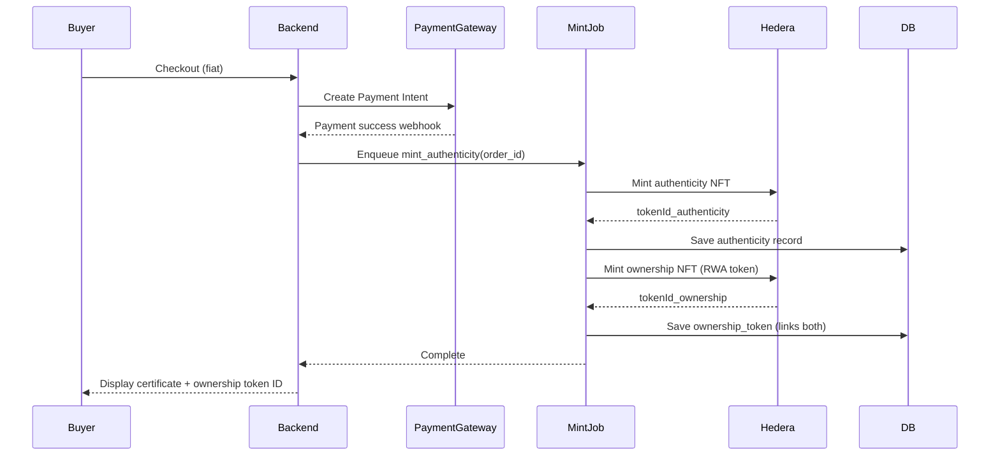
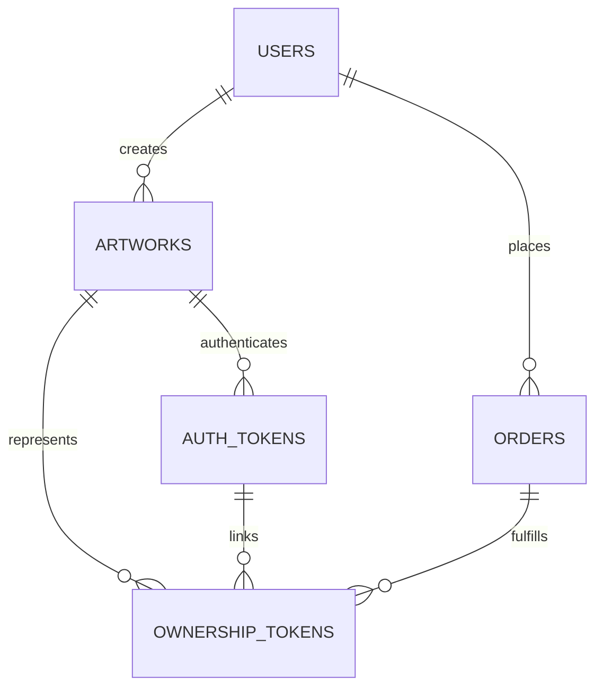

## 🎯 Goal

Enhance your current MVP so every physical (and digital) artwork can be:

1. **Digitally authenticated** (already done with your Hedera NFT),
2. **Tokenized for ownership transfer** — a transferable “ownership NFT” that represents the *real* asset,
3. **Future-ready for fractionalization** (by storing structured metadata now).

---

## ⚙️ 1. Architectural Extension

You can keep your MVP architecture 100% intact and **add one service + one table**:

### 🔹 New Service: `tokenization_service`

* A lightweight module or NestJS provider that:

  * Creates a *transferable* token on Hedera (HTS NFT).
  * Embeds metadata linking to the original authenticity NFT.
  * Optionally supports fractionalization metadata later.
* Triggered **after** authenticity minting succeeds.

### 🔹 New Table: `ownership_tokens`

```sql
ownership_tokens (
  id uuid primary key,
  artwork_id uuid references artworks(id),
  owner_id uuid references users(id),
  hedera_token_id text,
  hedera_tx_hash text,
  authenticity_token_id uuid references auth_tokens(id),
  metadata_ipfs text,
  transferable boolean default true,
  fractions integer default 1,
  created_at timestamptz,
  updated_at timestamptz
)
```

---

## 🧠 2. Flow Integration (extends your existing sequence)



---

## 🧩 3. Metadata Structure for RWA Token

You’ll mint **two related tokens**:

| Token               | Purpose                                  | Transferable | Notes                                 |
| ------------------- | ---------------------------------------- | ------------ | ------------------------------------- |
| `AuthenticityToken` | Proof of origin                          | ❌            | non-transferable                      |
| `OwnershipToken`    | Represents legal possession of the asset | ✅            | transferable, future fractionalizable |

### Example Ownership Token Metadata (JSON)

Store this on IPFS and reference it in the mint call:

```json
{
  "asset_type": "physical_artwork",
  "title": "Sapphire Dreams",
  "artist": "Tobi Rahmoni",
  "authenticity_token_id": "0.0.123456",
  "serial_number": "001",
  "description": "Oil on canvas, 2025",
  "media": "ipfs://QmImageCID",
  "ownership_rights": {
    "transferable": true,
    "fractions": 1,
    "legal_doc_hash": "sha256-abc123..."
  },
  "provenance": [
    { "owner": "Artist", "tx": "0.0.aaa", "date": "2025-10-25" },
    { "owner": "Buyer", "tx": "0.0.bbb", "date": "2025-10-26" }
  ],
  "platform": "YourMarketplace v1.0"
}
```

> 🔒 For now, just store a placeholder for `legal_doc_hash`. Later, you can actually hash a sale agreement PDF.

---

## 💻 4. Implementation Steps (with MVP Codebase)

### **Step 1 – Extend your mint job**

In your existing `mint_authenticity` worker, after minting the authenticity NFT:

```ts
import { Client, TokenCreateTransaction, TokenType } from "@hashgraph/sdk";

async function mintOwnershipToken(artwork, authenticityToken) {
  const client = Client.forMainnet()
    .setOperator(process.env.HEDERA_ACCOUNT_ID, process.env.HEDERA_PRIVATE_KEY);

  const tokenCreateTx = await new TokenCreateTransaction()
    .setTokenName(`${artwork.title} Ownership`)
    .setTokenSymbol(`OWN-${artwork.serial_number}`)
    .setTokenType(TokenType.NonFungibleUnique)
    .setTreasuryAccountId(process.env.HEDERA_ACCOUNT_ID)
    .setMaxSupply(1)
    .freezeWith(client)
    .signWithOperator(client);

  const response = await tokenCreateTx.execute(client);
  const receipt = await response.getReceipt(client);

  return {
    hederaTokenId: receipt.tokenId.toString(),
    txHash: response.transactionId.toString(),
  };
}
```

Then update your job handler:

```ts
const authToken = await mintAuthenticityToken(order);
await db.auth_tokens.create(...authToken);

const ownershipToken = await mintOwnershipToken(order.artwork, authToken);
await db.ownership_tokens.create(...ownershipToken);
```

### **Step 2 – Add ownership certificate UI**

On the buyer’s post-purchase “certificate” page:

* Display both `Authenticity Token` and `Ownership Token` IDs.
* Add “View on Hedera Explorer” links.

### **Step 3 – Extend API**

Add route:

```http
GET /ownership/:artworkId
```

→ returns ownership_token details, owner, metadata, Hedera explorer link.

---

## 🧮 5. Data Relationship Diagram (new links)



---

## 🧾 6. UX Impact (minimal)

* Add a section in the buyer’s “Order Details” page:
  **Authenticity Certificate** → shows token ID (proof)
  **Ownership Certificate** → shows transferable token ID (rights)
* Artists see both in their dashboard too, but they can’t transfer after sale.

---

## 🧱 7. Future-Proof Hooks (no code changes later)

Add these two metadata fields now:

* `ownership_tokens.fractions` (integer)
* `ownership_tokens.transferable` (boolean)